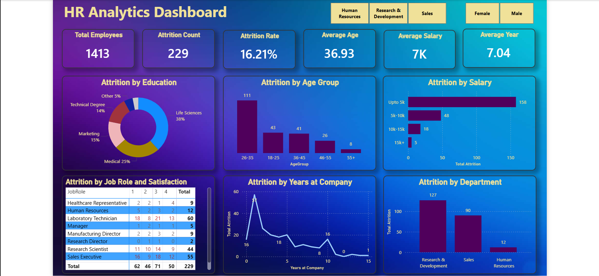

# 📊 HR Analytics Dashboard using Power BI

## 🔍 Project Overview

This project showcases an **interactive HR Analytics dashboard** built using Power BI to analyze employee attrition and workforce trends.

The objective is to identify key factors influencing employee turnover and provide **data-driven insights** to improve employee retention and organizational performance.

---

## 🎯 Problem Statement

Employee attrition is a major challenge for organizations, leading to:

* Increased hiring and training costs
* Loss of experienced employees
* Reduced productivity

This dashboard helps HR teams understand **why employees leave** and take strategic actions.

---

## 📁 Project Files

* `HR_Analytics_Dashboard.pbix` → Power BI dashboard
* `HR_Dataset.csv` → Dataset used for analysis
* `dashboard_preview.png` → Dashboard screenshot

---

## ⚙️ Workflow / Steps Followed

### 1️⃣ Data Collection

* Imported HR dataset from CSV

### 2️⃣ Data Cleaning (Power Query)

* Removed duplicates
* Handled missing values
* Standardized columns
* Corrected data types

### 3️⃣ Data Modeling

* Created relationships
* Built calculated columns and measures using DAX

### 4️⃣ Dashboard Development

* Designed KPI cards
* Created interactive visuals:

  * Bar charts
  * Donut charts
  * Line charts
  * Matrix tables
* Added slicers for filtering

---

## 📊 Key Metrics

* 👥 Total Employees: **1413**
* 📉 Attrition Count: **229**
* 📊 Attrition Rate: **16.21%**
* 🎂 Average Age: **36.93 years**
* 💰 Average Salary: **7K**
* ⏳ Average Tenure: **7.04 years**

---

## 📈 Key Insights

* 🔴 Highest attrition in **26–35 age group**
* 💰 Employees earning **≤5K salary** show highest attrition
* 🎓 **Life Sciences** field has maximum attrition
* 🏢 **Research & Development** department most affected
* ⏳ Majority attrition occurs in **first 2 years**
* 👨‍💼 Roles like **Sales Executive & Lab Technician** show high turnover

---

## 📊 Dashboard Features

* Attrition analysis by Age, Salary, Education, and Department
* Job Role vs Satisfaction matrix
* Attrition trend by years at company
* Interactive filters (Department, Gender)
* KPI summary cards

---

## 🛠 Tools & Technologies

* Power BI
* Power Query
* DAX
* CSV / Excel

---

## 🧠 Skills Demonstrated

* Data Cleaning & Transformation
* Data Visualization
* KPI Analysis
* Business Insight Generation
* Dashboard Design

---

## 💼 Business Impact

This dashboard enables organizations to:

* Identify high-risk employee segments
* Improve retention strategies
* Optimize HR policies
* Make data-driven decisions

---

## 🚀 How to Use

1. Download the `.pbix` file
2. Open in Power BI Desktop
3. Explore dashboard using filters

---

## 🌟 Future Improvements

* Add attrition analysis by **Gender and Job Level**
* Improve UI with professional color palette
* Integrate real-time data

---

## 👩‍💻 Author

**Sneha Rani Thakur**
Aspiring Data Analyst | Power BI Enthusiast

---

⭐ If you found this project useful, give it a star!
